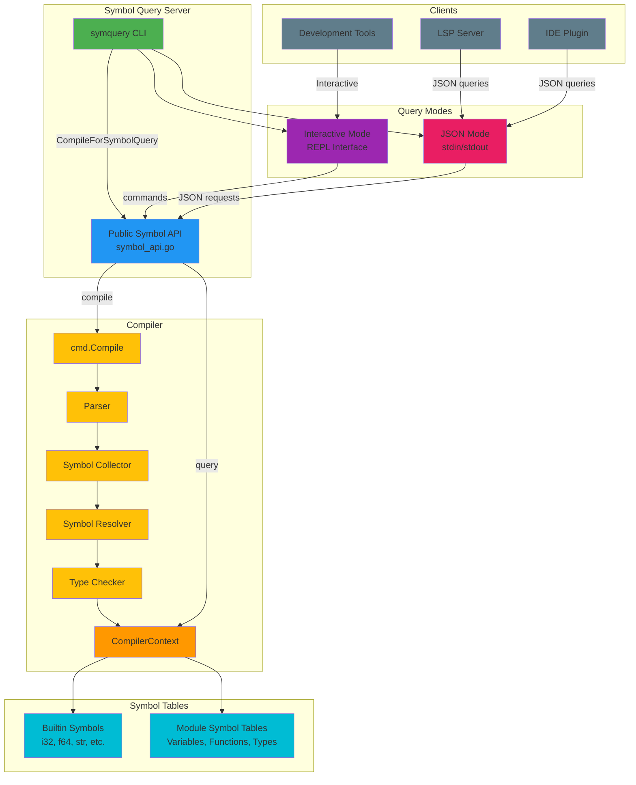
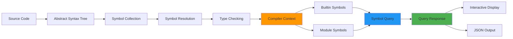

## Architecture Overview

### Compilation Flow
1. User runs `symquery <project-root>`
2. symquery calls `CompileForSymbolQuery()` (public API)
3. Public API calls internal `Compile()` function
4. Compilation proceeds through phases:
   - **Parser**: Source code → AST
   - **Collector**: AST → Symbol Tables
   - **Resolver**: Symbol References → Definitions
   - **TypeCheck**: Type validation and inference
5. **CompilerContext** holds all symbol tables and state
6. symquery wraps context in **SymbolQueryAPI**
7. Server enters query mode (Interactive or JSON)

### Data Access Pattern
```
symquery (external) 
    ↓ (cannot access internal packages)
Public API (symbol_api.go)
    ↓ (can access internal packages)
Internal Compiler (ctx, symbol, modules)
    ↓
Symbol Tables (in-memory)
```

### Query Processing
```
User Command
    ↓
Command Parser (main.go)
    ↓
HandleQuery() switch on command type
    ↓
SymbolQueryAPI method call
    ↓
Access CompilerContext
    ↓
Lookup in Symbol Tables
    ↓
Convert to DTO (SymbolDetails)
    ↓
Return QueryResponse
    ↓
Format output (JSON or pretty-print)
```

## Symbol Information Flow



## Module Organization

```
ferret-compiler/
├── compiler/               # Main compiler
│   └── cmd/
│       └── symbol_api.go   # PUBLIC API for symbol queries
│       └── compiler.go     # Internal compilation logic
│       └── ...
├── symquery/               # Symbol Query Server
│   ├── main.go            # Interactive & JSON modes
│   ├── go.mod             # Module definition
│   ├── README.md          # User documentation
│   ├── IMPLEMENTATION.md  # Technical details
│   └── USER_GUIDE.md      # Complete guide
└── scripts/
    ├── symquery.sh        # Build & run script (Unix)
    └── symquery.bat       # Build & run script (Windows)
```

## Component Responsibilities

### symquery/main.go
- Parse command-line arguments
- Initialize SymbolQueryServer
- Trigger compilation via public API
- Run interactive or JSON mode
- Handle user input/output
- Format responses

### compiler/cmd/symbol_api.go
- **Bridge** between external tools and compiler internals
- Expose safe, stable API
- Convert internal types to DTOs
- Implement query operations:
  - LookupSymbol()
  - GetAllModules()
  - GetModuleSymbols()
  - GetBuiltinSymbols()
  - GetStatistics()

### Compiler Context (internal)
- Stores all compiled state
- Manages module loading
- Tracks dependencies
- Holds symbol tables
- Manages error reports

## Integration Points

### For LSP Server
```
LSP Server (TypeScript/Node.js)
    ↓ spawn process
symquery --json
    ↓ stdin/stdout
JSON Request/Response
    ↓
Symbol Information
    ↓
LSP Features (hover, definition, etc.)
```

### For Development Tools
```
Tool (Python/Go/etc.)
    ↓ spawn process or call interactively
symquery
    ↓ commands
Query Interface
    ↓
Symbol Data
    ↓
Tool-specific features
```
